# Data Flow Diagram (DFD) Generator

Automated generation of multi-layer Data Flow Diagrams from infrastructure-as-code resources with trust boundary identification and Mermaid visualization.

## Overview

The DFD Generator creates three-layer architecture diagrams that visualize data flows, trust boundaries, and security zones in cloud infrastructure:

1. **Service Level** - High-level services and inter-service communication
2. **Component Level** - Components within services (APIs, databases, caches)
3. **Code Level** - Function calls, library dependencies, external APIs

```
┌─────────────────────────────────────────────────────────────────┐
│                    Infrastructure Resources                     │
│            (Terraform, CloudFormation, ARM, etc.)              │
└────────────────────────┬────────────────────────────────────────┘
                         │
                         │ parsed resources
                         ▼
┌─────────────────────────────────────────────────────────────────┐
│                      DFD Generator                              │
│  ┌──────────────┐  ┌──────────────┐  ┌─────────────────────┐   │
│  │  Service     │  │  Component   │  │     Code Level      │   │
│  │  Level DFD   │  │  Level DFD   │  │      DFD            │   │
│  └──────┬───────┘  └──────┬───────┘  └─────────┬───────────┘   │
│         │                 │                    │               │
│         │  trust boundary detection           │               │
│         │  data flow inference                │               │
│         │  classification tagging             │               │
│         └─────────────────┴────────────────────┘               │
└────────────────────────────┬────────────────────────────────────┘
                             │
                             │ nodes + edges + boundaries
                             ▼
┌─────────────────────────────────────────────────────────────────┐
│                     Mermaid Exporter                            │
│     flowchart TB with subgraphs, colors, encryption icons      │
└────────────────────────┬────────────────────────────────────────┘
                         │
                         ▼
              Mermaid Diagram / SVG / JSON
```

## Features

### 🎯 Three-Layer Architecture

- **Service Level**: Cloud services, high-level data flows, business architecture
- **Component Level**: APIs, databases, caches, request/response patterns
- **Code Level**: Function calls, external APIs, data access patterns

### 🔒 Security Analysis

- **Trust Boundary Detection**: Internet, DMZ, Internal, Private, Restricted zones
- **Data Classification**: Public, Internal, Confidential, Restricted, PII, PHI
- **Cross-Boundary Flow Detection**: Identify flows crossing security zones
- **Encryption Status**: Track encrypted vs unencrypted connections

### 📊 Visualization

- **Mermaid Diagrams**: Generate flowcharts with trust boundary subgraphs
- **Color Coding**: Visual distinction of security zones
- **Shape Mapping**: Different shapes for services, databases, APIs, etc.
- **SVG Export**: HTML template for browser-based SVG generation

### ☁️ Multi-Cloud Support

- **GCP**: Cloud SQL, Compute Engine, Cloud Storage, Cloud Run, etc.
- **AWS**: RDS, EC2, S3, Lambda, API Gateway, etc.
- **Azure**: SQL Database, VMs, Storage Accounts, Functions, etc.

## Installation

```bash
cd backend/analysis
pip install -r requirements.txt
```

Dependencies:
- Python 3.12+
- pytest (for testing)

## Quick Start

### Python API

```python
from dfd.dfd_generator import DFDGenerator
from dfd.mermaid_exporter import MermaidExporter

# Sample infrastructure resources
resources = [
    {
        'id': 'api-1',
        'resource_type': 'google_cloud_run_service',
        'name': 'payment-api',
        'properties': {}
    },
    {
        'id': 'db-1',
        'resource_type': 'google_sql_database_instance',
        'name': 'payment-db',
        'properties': {
            'settings': {
                'ip_configuration': {
                    'ipv4_enabled': False
                }
            },
            'encrypted': True
        }
    }
]

# Generate service-level DFD
generator = DFDGenerator()
dfd = generator.generate_service_level_dfd(resources)

print(f"Generated DFD with {len(dfd.nodes)} nodes and {len(dfd.edges)} edges")
print(f"Trust boundaries: {[b.name for b in dfd.trust_boundaries]}")

# Export to Mermaid
exporter = MermaidExporter()
mermaid_diagram = exporter.export_to_mermaid(dfd)
print(mermaid_diagram)

# Get statistics
stats = dfd.get_statistics()
print(f"Statistics: {stats}")
```

### TypeScript API

```typescript
import { DFDGeneratorClient } from './services/dfdGeneratorClient';

const client = new DFDGeneratorClient();

// Generate service-level DFD
const resources = [
  {
    id: 'api-1',
    resource_type: 'aws_lambda_function',
    name: 'order-processor',
    properties: {}
  },
  {
    id: 'db-1',
    resource_type: 'aws_db_instance',
    name: 'orders-db',
    properties: {
      publicly_accessible: false,
      storage_encrypted: true
    }
  }
];

const dfd = await client.generateServiceLevelDFD(resources);
console.log(`Nodes: ${dfd.nodes.length}, Edges: ${dfd.edges.length}`);

// Export to Mermaid
const mermaid = await client.exportToMermaid(dfd);
console.log(mermaid);

// Get summary
const summary = await client.getDFDSummary(dfd);
console.log('Security summary:', summary.security);
```

### Flask API

```bash
# Generate service-level DFD
curl -X POST http://localhost:3002/dfd/generate/service \
  -H "Content-Type: application/json" \
  -d '{
    "resources": [
      {
        "id": "api-1",
        "resource_type": "google_cloud_run_service",
        "name": "payment-api",
        "properties": {}
      }
    ]
  }'

# Generate all three levels
curl -X POST http://localhost:3002/dfd/generate/all \
  -H "Content-Type: application/json" \
  -d '{
    "resources": [...],
    "code_flows": [
      {
        "function": "processPayment",
        "calls": ["validateCard", "chargeCard"],
        "external_apis": ["stripe.com/charge"],
        "data_access": ["payments_db"]
      }
    ]
  }'

# Export to Mermaid
curl -X POST http://localhost:3002/dfd/export/mermaid \
  -H "Content-Type: application/json" \
  -d '{
    "dfd": {...},
    "include_trust_boundaries": true
  }'
```

## Architecture Components

### 1. Data Models (`models/dfd.py`)

```python
class NodeType(Enum):
    SERVICE, DATABASE, STORAGE, COMPUTE, NETWORK, API, 
    CACHE, QUEUE, FUNCTION, EXTERNAL, USER, ...

class TrustBoundary(Enum):
    INTERNET, DMZ, INTERNAL, PRIVATE, RESTRICTED

class DataClassification(Enum):
    PUBLIC, INTERNAL, CONFIDENTIAL, RESTRICTED, PII, PHI

@dataclass
class DFDNode:
    id: str
    label: str
    type: NodeType
    trust_boundary: Optional[TrustBoundary]
    properties: Dict

@dataclass
class DFDEdge:
    source: str
    target: str
    label: str
    data_classification: Optional[DataClassification]
    protocol: Optional[str]
    encrypted: bool

@dataclass
class DFD:
    level: str
    nodes: List[DFDNode]
    edges: List[DFDEdge]
    trust_boundaries: List[TrustBoundaryGroup]
```

### 2. DFD Generator (`dfd/dfd_generator.py`)

**Key Methods:**

- `generate_service_level_dfd(resources)` - High-level service architecture
- `generate_component_level_dfd(resources)` - Component decomposition
- `generate_code_level_dfd(code_flows)` - Function-level flows
- `generate_all_levels(resources, code_flows)` - All three layers

**Features:**

- **Auto-detection**: Infers node types from resource types
- **Trust Boundaries**: Determines security zones based on properties
- **Data Flow Inference**: Heuristics for detecting connections
- **Multi-cloud**: Supports GCP, AWS, Azure resource types

### 3. Mermaid Exporter (`dfd/mermaid_exporter.py`)

**Capabilities:**

- Flowchart generation with trust boundary subgraphs
- Node shape mapping (services, databases, APIs)
- Color coding by trust boundary
- Encryption indicators (🔒)
- SVG export via HTML template
- Summary statistics

**Example Output:**

```mermaid
flowchart TB

subgraph DMZ_Zone["DMZ Zone"]
  api{{Payment API}}
end

subgraph Restricted_Zone["Restricted Zone"]
  database[(Cloud SQL)]
end

api -->|"queries (SQL) 🔒"| database

style api fill:#ffd93d,stroke:#333,stroke-width:2px
style database fill:#845ef7,stroke:#333,stroke-width:2px
```



## Trust Boundary Detection

The generator automatically assigns trust boundaries based on resource properties:

### Internet Zone
- Public S3 buckets (`acl: public-read`)
- Databases with `0.0.0.0/0` authorized networks
- Resources exposed to internet

### DMZ Zone
- Resources with public IPs
- Load balancers
- API gateways
- Databases with IPv4 enabled (non-public)

### Internal Zone
- Default for most resources
- Private networks
- Internal services

### Private Zone
- Encrypted databases without public access
- Private subnets
- Restricted network access

### Restricted Zone
- Highly sensitive data stores
- Encrypted databases
- Compliance-required isolation

## Data Classification

Edges are automatically classified based on context:

- **PUBLIC**: External connections, internet-facing APIs
- **INTERNAL**: Service-to-service within organization
- **CONFIDENTIAL**: Database queries, sensitive storage
- **RESTRICTED**: Highly regulated data
- **PII**: Personal information flows
- **PHI**: Protected health information

## Code-Level DFD

For code-level analysis, provide function call graphs:

```python
code_flows = [
    {
        'function': 'processPayment',
        'calls': ['validateCard', 'chargeCard', 'saveTransaction'],
        'external_apis': ['stripe.com/charge', 'plaid.com/verify'],
        'data_access': ['payments_db', 'audit_log']
    },
    {
        'function': 'validateCard',
        'calls': ['checkCardNumber', 'verifyExpiry', 'validateCVV'],
        'external_apis': [],
        'data_access': []
    }
]

dfd = generator.generate_code_level_dfd(code_flows)
```

This generates function-level nodes showing:
- Function call hierarchy
- External API dependencies
- Database access patterns
- Trust boundaries (internal functions vs external APIs)

## Use Cases

### 1. Threat Modeling

```python
# Generate DFD
dfd = generator.generate_service_level_dfd(resources)

# Identify high-risk flows
cross_boundary = dfd.get_cross_boundary_edges()
high_risk = [e for e in cross_boundary 
             if e.data_classification in [DataClassification.CONFIDENTIAL,
                                         DataClassification.PII]]

print(f"Found {len(high_risk)} high-risk cross-boundary flows")
```

### 2. Compliance Documentation

```python
# Export Mermaid diagrams for all levels
result = generator.generate_all_levels(resources, code_flows)

exporter = MermaidExporter()
service_diagram = exporter.export_to_mermaid(result.service_level)
component_diagram = exporter.export_to_mermaid(result.component_level)

# Generate compliance report
summary = exporter.export_summary(result.service_level)
print(f"Trust boundaries: {summary['trust_boundaries']}")
print(f"Encrypted flows: {summary['security']['encrypted_flows']}")
```

### 3. Architecture Review

```python
# Generate all levels
result = generator.generate_all_levels(resources)

# Review statistics
service_stats = result.service_level.get_statistics()
component_stats = result.component_level.get_statistics()

print("Service Level:")
print(f"  Nodes: {service_stats['total_nodes']}")
print(f"  Trust boundaries: {service_stats['trust_boundaries']}")

print("Component Level:")
print(f"  Nodes: {component_stats['total_nodes']}")
print(f"  API components: {component_stats['node_types'].get('api', 0)}")
```

## Testing

Run comprehensive test suite:

```bash
cd backend/analysis
source venv/bin/activate
pytest tests/test_dfd_generator.py -v
```

**Test Coverage:**
- ✅ 27 tests covering all features
- Data model creation and validation
- Service/component/code-level generation
- Trust boundary inference
- Data flow detection
- Mermaid export
- Multi-cloud resources
- Integration workflows

## API Reference

### Flask Endpoints

| Endpoint | Method | Description |
|----------|--------|-------------|
| `/dfd/generate/service` | POST | Generate service-level DFD |
| `/dfd/generate/component` | POST | Generate component-level DFD |
| `/dfd/generate/code` | POST | Generate code-level DFD |
| `/dfd/generate/all` | POST | Generate all three levels |
| `/dfd/export/mermaid` | POST | Export DFD to Mermaid syntax |
| `/dfd/export/svg` | POST | Export DFD to SVG HTML |
| `/dfd/summary` | POST | Get DFD statistics and security summary |

### Python Classes

**DFDGenerator:**
- `generate_service_level_dfd(resources: List[Dict]) -> DFD`
- `generate_component_level_dfd(resources: List[Dict]) -> DFD`
- `generate_code_level_dfd(code_flows: List[Dict]) -> DFD`
- `generate_all_levels(resources, code_flows) -> DFDGenerationResult`

**MermaidExporter:**
- `export_to_mermaid(dfd: DFD, include_trust_boundaries: bool) -> str`
- `export_to_svg(dfd: DFD) -> str`
- `export_summary(dfd: DFD) -> Dict`

**DFD:**
- `get_node_by_id(node_id: str) -> Optional[DFDNode]`
- `get_cross_boundary_edges() -> List[DFDEdge]`
- `get_external_connections() -> List[DFDEdge]`
- `get_statistics() -> Dict`

## Performance

- **Service-level DFD**: ~50-100ms for 10-20 resources
- **Component-level DFD**: ~100-200ms (includes decomposition)
- **Code-level DFD**: ~50ms for 20-30 functions
- **Mermaid export**: ~10-20ms

**Optimizations:**
- Resource type mapping for O(1) node inference
- Trust boundary caching
- Lazy edge detection

## Troubleshooting

### Issue: No edges detected

**Solution**: Provide explicit relationships or ensure resource names/IDs reference each other.

### Issue: Wrong trust boundary

**Solution**: Override with explicit `trust_boundary` property in resource metadata.

### Issue: Mermaid syntax error

**Solution**: Check for special characters in labels. The exporter escapes quotes but other characters may need escaping.

## Roadmap

- [ ] Auto-detection from Terraform state files
- [ ] CloudFormation template parsing
- [ ] Kubernetes resource mapping
- [ ] Interactive Mermaid editor integration
- [ ] PDF/PNG export via headless browser
- [ ] Custom trust boundary rules
- [ ] Data lineage tracking
- [ ] Attack path visualization

## Contributing

To extend the DFD generator:

1. **Add resource type mapping** in `RESOURCE_TYPE_MAPPING`
2. **Extend trust boundary logic** in `_infer_trust_boundary()`
3. **Add data flow patterns** in `_detect_data_flows()`
4. **Create tests** in `tests/test_dfd_generator.py`

## License

Part of the Threat Modeling Platform.
